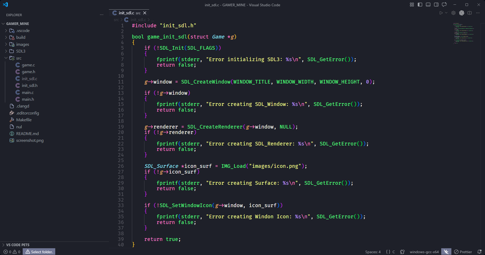

# 💣 CAMPO MINADO SAM (C + SDL3)



Implementação do clássico **Campo Minado** desenvolvida em **C** utilizando a biblioteca **SDL3**.

---

## 🎮 Sobre o jogo

Descubra todas as casas que **não contêm minas** para vencer.

- Clique com o botão **esquerdo** para revelar uma casa
- Clique com o botão **direito** para marcar:
  - 🚩 Bandeira (possível mina)
  - ❓ Interrogação (incerto)

### 🧠 Regras

- Casas numeradas indicam quantas minas existem ao redor
- O contador no topo:
  - 🔢 Esquerda → minas restantes (estimadas)
  - ⏱ Direita → tempo de jogo
- A primeira jogada nunca resulta em derrota imediata

---

## 🛠️ Tecnologias

- Linguagem: **C**
- Biblioteca gráfica: SDL3 (Simple DirectMedia Layer)
- Build: **Makefile**

---

## ⚙️ Instalação

### 🐧 Arch Linux

Instale o SDL3:

```bash
sudo pacman -S --needed base-devel sdl3
```

Instale o SDL3_image (AUR):

```bash
cd ~
git clone https://aur.archlinux.org/sdl3_image-git.git
cd sdl3_image-git
makepkg -si
```

Clone o projeto:

```bash
git clone https://github.com/SEU_USUARIO/SEU_REPOSITORIO.git
cd SEU_REPOSITORIO
make run
```

---

### 🪟 Windows (MinGW)

1. Baixe o SDL3 (versão **mingw**)
2. Extraia dentro da pasta do projeto:

```
SDL3/x86_64-w64-mingw32/
SDL3_image/
```

3. Execute:

```bash
make run
```

---

## 🚀 Comandos Make

```bash
make          # compila + executa
make run      # executa
make clean    # limpa build
make rebuild  # limpa + recompila
make debug    # build com debug
make release  # build otimizado
```

---

## 🎮 Controles

| Tecla | Ação |
|------|------|
| Clique esquerdo | Revelar casa |
| Clique direito | Marcar casa |
| Clique no rosto 🙂 | Resetar jogo |
| `1 - 8` | Alterar tema |
| `Q W E R T` | Tamanho do tabuleiro |
| `A S D F` | Dificuldade |
| `B` | Alternar tamanho |
| `N` | Novo jogo |
| `ESC` | Sair |

---

## 📁 Estrutura do projeto

```
.
├── build/
├── src/
│   ├── main.c
│   ├── game.c
│   ├── init_sdl.c
│   └── ...
├── SDL3/
├── Makefile
└── README.md
```

---

## 🧠 Aprendizados

Este projeto aborda:

- Inicialização e uso do SDL3
- Game loop básico
- Gerenciamento de eventos
- Estruturação modular em C
- Build com Makefile

---

## 🚧 Próximos passos

- [ ] Sistema de renderização mais robusto
- [ ] Animações
- [ ] Melhor controle de tempo
- [ ] Refatoração para arquitetura de engine

---

## 📄 Licença

Este projeto está sob a licença MIT.

---

## 🤝 Contribuição

Pull requests são bem-vindos!
Sinta-se livre para abrir issues ou sugerir melhorias.

---

## 👤 Autor

Desenvolvido por **Silvanei Martins**

- 💼 [LinkedIn](https://www.linkedin.com/in/silvanei-martins-a5412436)
- 🌐 [Site Pessoal](https://silvaneimartins.com.br/)
- 🐱 [GitHub](https://github.com/Store-Sam-Martins)
- 📧 silvaneimartins_rcc@hotmail.com
- 🎥 [YouTube](https://www.youtube.com/@silvaneimartins2487/featured)
- 🐦 [X (Twitter)](https://x.com/SilvaneiMartins)

<a href="https://github.com/SilvaneiMartins">
    
    <br />
    <sub>
        <b>Silvanei de Almeida Martins</b>
    </sub>
</a>
     <a href="https://github.com/SilvaneiMartins" title="Silvanei martins" >
 </a>
<br />
🚀 Feito com ❤️ por Silvanei Martins
